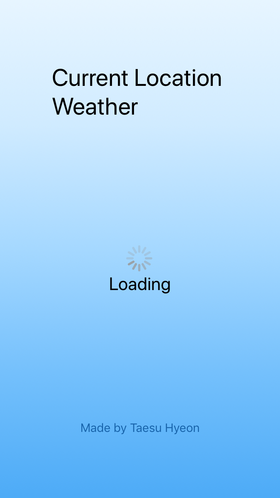

# [React-Native-Weather](https://github.com/qvil/react-native-weather)
Weather App using geographic coordinates created in react-native

## Example



## Getting started
>Reference to https://openweathermap.org and add your API_KEY in `App.js`

```
npm install
npm start
```

or using [Expo XDE](https://github.com/expo/xde/releases)

## Supported Languages
  - [English(Default)](README.md)
  - [한국어](README_KO.md)

## Reference
- https://www.inflearn.com/course/%EB%A6%AC%EC%95%A1%ED%8A%B8-%EB%84%A4%EC%9D%B4%ED%8B%B0%EB%B8%8C/
>Thank you for **Nicolás Serrano Arévalo**
- https://openweathermap.org
